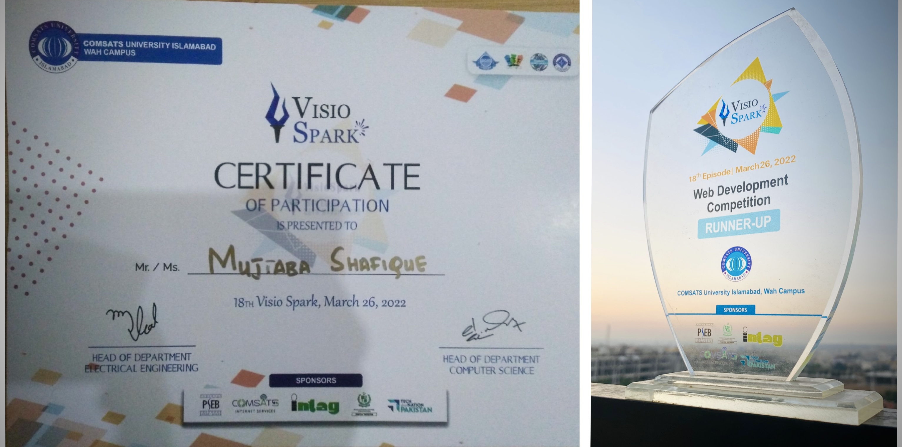

 

  <h1 align="center"> Sup Nerds.. </h1>
 <h1 align="center">
    
</h1>

<!--<a href="https://www.youtube.com/user/" target="_blank">-->
<!---->
<!--</a>  -->

 
  
  

<!-- 
  
 -->

  

<!--<a href="https://giphy.com/gifs/pudgypenguins-data-code-coding-2IudUHdI075HL02Pkk">via GIPHY</a>
-->
<!---->

- 🎓 I studied Software Engineering
- ❤️ Love to Code😋
- ⚡ Interested  to develop beautiful web applications
- 👯 Looking to collaborate on **Full Stack development**
- 🌱 Currently learning GraphQL & Radis
- ⚙️ In love with Open Source
- ☕️ Coffee and coding goes side by side for me
- 👨‍💻 [Portfolio](https://www.mujtabacodes.com/#projects)
- 📫 Reach me via mail **mujtaba.shafique@outlook.com**
- 📝 [Resume](https://www.mujtabacodes.com/)

🥂 Cheers!
 
 
<h2 align="center">⚒️ Languages-Frameworks-Tools ⚒️</h2>
 

    
    
    
    
     
    
    
    
    
  
    
    
    
    

    
     
    
    
     
    
    
     
    
  

    
<
  
<h2 align="center">⚡ Stats ⚡</h2>
 

    
  

   
    

  
<h2 ali
<h2 align="center">⚡ Hackathons🥇 & Certifications✨</h2>

   <a href="https://lablab.ai/event/ibm-watsonx-challenge/dragons/sphera">
     
      &nbsp; &nbsp;
        </a>
   <a href="https://ww2.comsats.edu.pk/ciitblogs/BlogsDetailsOuter.aspx?ArticleId=196566">
     
      &nbsp; &nbsp;
        </a>
        
    

<h2 align="center"></h2>
 

    

<h2 align="center">🎖️Project Demo Playlist🎖️</h2>

  🚧 These are just a few <strong><em> handpicked public demos</em></strong> I’ve chosen to showcase. Some projects are under NDA or involve sensitive business logic, so can’t be shared.

  

<!---->
<!--<h3 align="center">-->
  

</h3>

